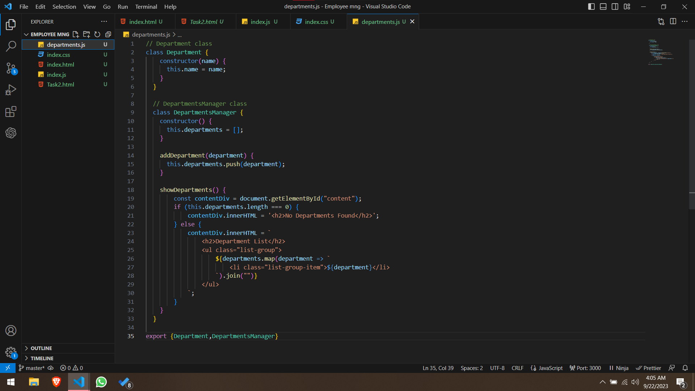

This is a HR dasboard app which contains some menu of options to show the employes, add employees,  remove them. Along with other options it also have a Reimbursement system where the HR aprove reimbursement requests. 
 
This App is completely made up with Vanila JS, HTML & CSS. 

The important JS topics which are used in this project are: 

1. Swith-case: 
2. Classes: 
3. Try-catch: 

